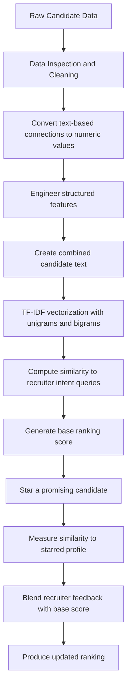

A machine learning and information-retrieval project for **ranking job candidates by role fit** and **dynamically re-ranking them when recruiter preferences change**.

This project was built around a talent sourcing dataset containing candidate identifiers, job titles, locations, and connection counts. The goal is to generate a robust ranking of candidates for a target HR-related role using textual relevance, lightweight feature engineering, and recruiter-in-the-loop re-ranking.  

---

## Overview

Hiring teams often face a noisy top-of-funnel candidate list: profiles may be partially relevant, inconsistent in wording, and difficult to rank objectively at scale. This project approaches that challenge by combining:

- **Exploratory data analysis**
- **Text cleaning and preprocessing**
- **Feature engineering**
- **TF-IDF-based candidate relevance scoring**
- **Heuristic ranking**
- **Re-ranking based on starred candidates**

The result is an interpretable ranking pipeline that simulates how a recruiter might search for profiles using intent-based keywords such as:

- `Aspiring human resources`
- `seeking human resources`

---

## Business Problem

The objective is not just to sort profiles once, but to create a ranking system that can adapt to recruiter feedback.

### Core goals
- Rank candidates based on their likely fit for the role
- Re-rank candidates when a recruiter stars a promising profile
- Improve robustness despite limited structured data
- Reduce manual bias by making the ranking logic explicit and reproducible

---

## Dataset

The project uses a dataset of **104 candidate records** with the following fields:

- `id` — unique candidate identifier
- `job_title` — text field describing the candidate’s current title or profile headline
- `location` — candidate location
- `connection` — LinkedIn-style connection count, including values like `500+`
- `fit` — intended target score, but missing in the dataset used here

Because the `fit` target is entirely null in the notebook workflow, this project frames the problem as a **weakly supervised / heuristic ranking task** rather than a traditional supervised learning problem.  

---

## Repository Structure

```text
├── Potential_talents_EDA.ipynb
├── Potential_talents_model.ipynb
├── requirements.txt
└── README.md
````

### File guide

* **Potential_talents_EDA.ipynb**
  Performs data inspection, cleaning, preprocessing, and feature engineering.

* **Potential_talents_model.ipynb**
  Builds the ranking logic using TF-IDF similarity, heuristic scoring, and recruiter-feedback re-ranking.

* **requirements.txt**
  Lists project dependencies.

---

## Project Workflow



---

## Step-by-Step Approach

### 1) Data understanding and cleaning

The project starts with a review of dataset shape, data types, completeness, and field formatting. Since the target `fit` column is empty, the workflow focuses on building an interpretable ranking signal from the available profile metadata.

Cleaning steps include:

* trimming whitespace
* normalizing text fields
* converting `500+` connection values into numeric form
* dropping unusable target information for the ranking stage

### 2) Feature engineering

To make the profiles more machine-readable, the notebook creates several structured features from text and metadata, including:

* connection count as a numeric variable
* duplicate/frequency signal
* job title word count
* keyword match score
* binary indicators such as `has_aspiring` and `has_seeking`
* location-based flags such as Texas / California / New York
* a heuristic `seniority_score`

These features enrich the raw text and provide lightweight business signals beyond pure keyword matching.

### 3) Text-based relevance scoring

The core ranking signal is built using **TF-IDF vectorization** on combined candidate text derived from `job_title` and `location`.

The model uses:

* **stop-word removal**
* **unigrams and bigrams**
* **multiple recruiter-intent queries**

Candidate vectors are compared against query vectors using **cosine similarity**, and the mean similarity across queries becomes the foundation of the text relevance score.

### 4) Base ranking model

The notebook then combines:

* multi-query TF-IDF similarity
* seniority heuristic
* high-connection indicator

to create a **base score** for each candidate.

This is a practical, interpretable hybrid approach:

* TF-IDF captures semantic closeness to the target role wording
* seniority helps distinguish experience level
* connection count acts as a rough market-engagement signal

### 5) Recruiter-in-the-loop re-ranking

A standout part of the project is the re-ranking logic.

Once a recruiter stars a candidate:

* that candidate becomes a preference anchor
* the system computes similarity between all candidates and the starred profile
* a weighted blend updates the ranking

This simulates a realistic recruiting workflow where preferences become clearer after reviewing a few promising profiles.

---

## Key Modeling Logic

### Base score

The initial score is driven by relevance to role-based search intent.

**Conceptually:**

```text
Base Score = Text Relevance + Seniority Adjustment + Connection Adjustment + Sourcing Frequency Adjustment
```

### Updated score after starring

After starring a candidate, the project creates a new score:

```text
New Score = (1 - alpha) * Base Score + alpha * Star Similarity Score
```

Where:

* `alpha` controls how strongly recruiter feedback influences the new ranking
* higher `alpha` means stronger personalization toward the starred profile

This makes the ranking system responsive without discarding the original role-fit logic.

---

## Example Outcome

The notebooks show that the highest-ranked profiles in the base ranking strongly feature phrases like:

* *Aspiring Human Resources Manager*
* *Seeking Human Resources Opportunities*
* *Aspiring Human Resources Professional*

After a candidate is starred, the ranking shifts toward profiles that are more similar to that selected candidate, demonstrating how recruiter feedback can sharpen the shortlist.

---

## Why This Project Matters

This project demonstrates more than notebook-based analysis. It shows the ability to:

* translate an ambiguous business problem into a workable ranking framework
* handle missing targets pragmatically
* combine NLP techniques with interpretable business heuristics
* build a human-in-the-loop recommendation workflow
* communicate model behavior in a way that non-technical stakeholders can understand

---

## Tech Stack

* **Python**
* **Pandas**
* **NumPy**
* **Matplotlib**
* **Seaborn**
* **scikit-learn**
* **SciPy**
* **Jupyter Notebook**

---

## How to Run

### 1. Clone the repository

```bash
git clone https://github.com/ninad22dixit/T5wlnAkFVzQhUGBe.git
cd T5wlnAkFVzQhUGBe
```

### 2. Install dependencies

```bash
pip install -r requirements.txt
```

### 3. Open the notebooks

Run the notebooks in this order:

1. `Potential_talents_EDA.ipynb`
2. `Potential_talents_model.ipynb`

---

## Possible Improvements

This project is intentionally practical and interpretable, but it also opens the door to stronger production-ready extensions:

* Replace heuristic ranking with learning-to-rank methods when labels become available
* Use sentence embeddings or transformer-based semantic search
* Add entity normalization for titles, functions, and seniority levels
* Introduce bias auditing and fairness checks
* Build an interactive recruiter dashboard for starring, filtering, and thresholding
* Learn the re-ranking weight dynamically from recruiter behavior

---

## Final Thoughts

This project is a strong example of applied machine learning under imperfect real-world conditions: incomplete targets, noisy text, and evolving user preferences. Instead of forcing a conventional supervised model where labels were unavailable, the solution uses a thoughtful blend of information retrieval, feature engineering, and recruiter feedback loops to produce a flexible and interpretable ranking system.

```

